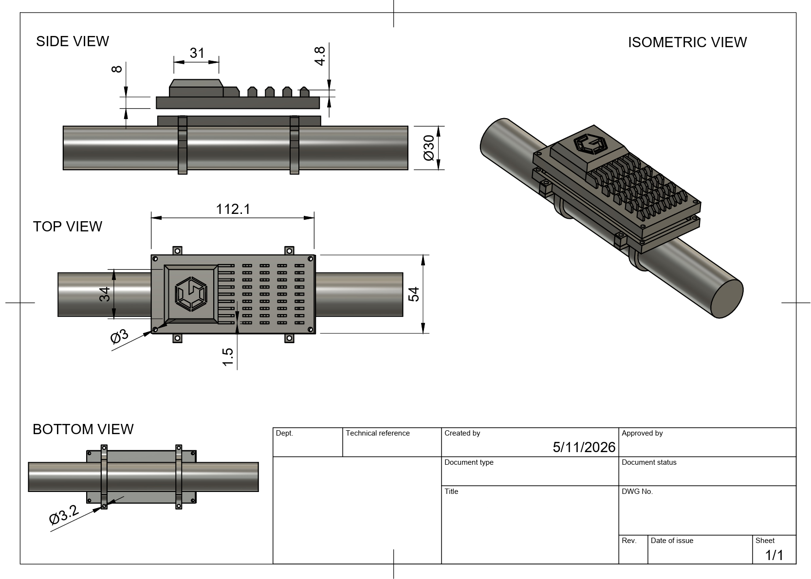
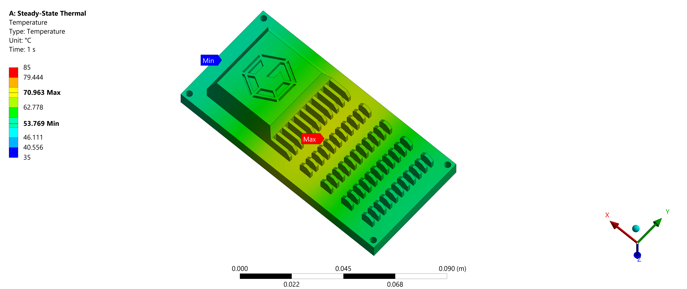
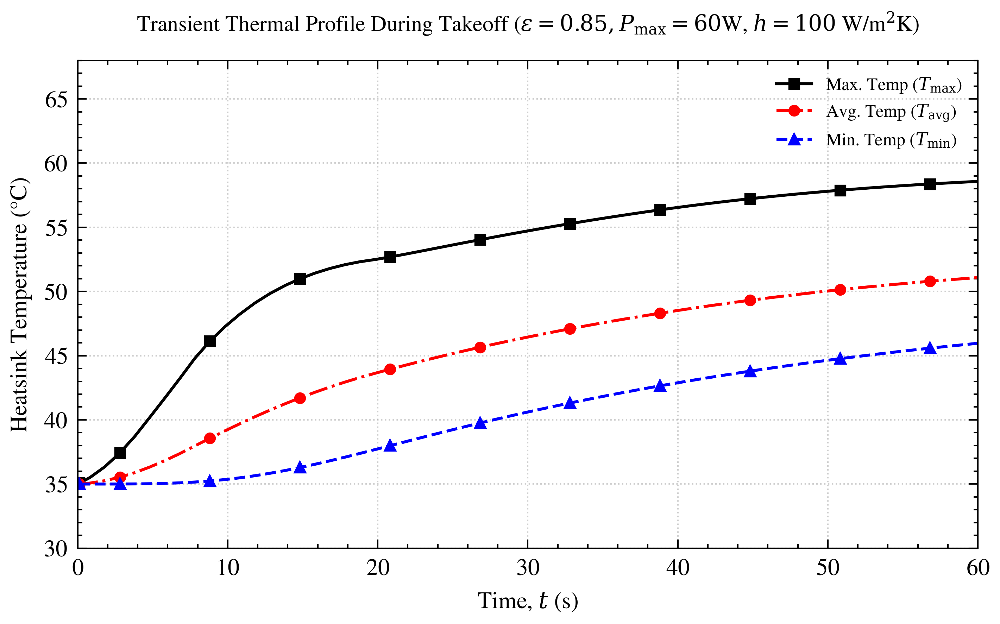
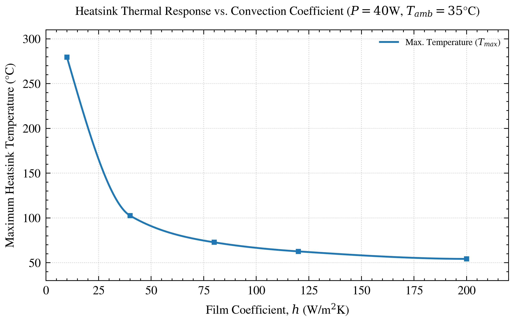

# Heatsink Design & Thermal Analysis

This folder contains the **heatsink design and thermal analysis** developed for the AgroESC power stage.

The heatsink was designed to manage the thermal load generated by the ESC power MOSFETs during high-current operation, with particular focus on the **60A continuous design target**.

---

## Overview

The thermal design process included:

- Heatsink mechanical design
- Thermal analysis
- Transient thermal analysis
- Convection analysis
- Finite Element Analysis (FEA)
- Heatsink performance comparison
- Thermal behavior during representative operating conditions

The objective was to develop a heatsink capable of effectively transferring heat from the MOSFET power stage to the surrounding airflow while maintaining acceptable component temperatures.

---

## Heatsink Design

The final heatsink geometry was designed considering:

- Available PCB space
- MOSFET mounting locations
- Thermal contact area
- Fin geometry
- Fin spacing
- Surface area
- Airflow
- Weight
- Manufacturability

### Heatsink Design

  

---

# Thermal Analysis

Several thermal simulations were performed to evaluate the heatsink under different operating conditions.

The analysis includes both **steady-state and transient thermal behavior**, allowing the heatsink performance to be evaluated during continuous operation as well as changing thermal loads.

## FEA Thermal Analysis

Finite Element Analysis (FEA) was performed to study the thermal distribution and identify potential hot spots within the heatsink.

  

---

## Transient Thermal Analysis

Transient analysis was performed to observe how the heatsink temperature changes with time from the initial thermal condition.

  

This helps evaluate:

- Initial temperature rise
- Thermal response time
- Heat accumulation
- Temperature stabilization
- Transient behavior during changing loads

---

## Convection Comparison

Different convection conditions were analyzed to understand the effect of airflow on heatsink performance.

  

The comparison helps determine the influence of airflow and convection coefficient on:

- Maximum heatsink temperature
- Temperature distribution
- Heat dissipation
- Thermal equilibrium

---

# Thermal Design Considerations

The heatsink design focuses on improving heat transfer through:

- Increased surface area
- Extended fin geometry
- Improved convection
- Reduced thermal resistance
- Efficient thermal coupling to the power stage
- Utilization of drone propeller airflow

For an agricultural drone ESC, airflow generated by the propellers can provide significant forced convection during operation.

