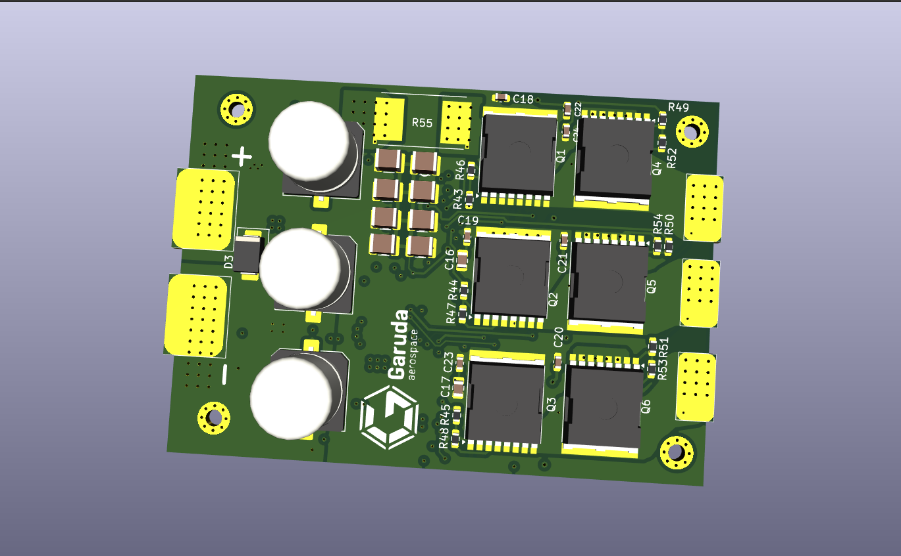
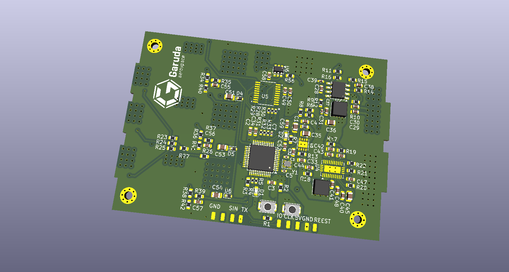

# AgroESC

### 12S–14S 60A Sensorless BLDC ESC for Agricultural Drones

<p align="center">
  
</p>

<p align="center">
  <b>STM32F051 · DRV8300 · IPT015N10N5 · DShot · Sensorless BEMF · AM32</b>
</p>

---

## Overview

**AgroESC** is a high-voltage, high-current sensorless BLDC Electronic Speed Controller designed for agricultural drones, heavy-lift multirotors, and other high-power UAV applications.

The ESC is designed for **12S–14S LiPo batteries** with a **60A continuous current target**.

The hardware is based on an **STM32F051** microcontroller, **DRV8300** three-phase gate driver, and six **IPT015N10N5** power MOSFETs.

The ESC uses **sensorless six-step BLDC commutation** with Back-EMF rotor-position detection and communicates with the flight controller using **DShot**.

The hardware is designed for compatibility with **AM32 firmware**.

---

## Features

- 12S–14S LiPo operation
- 60A continuous current design target
- Sensorless BLDC operation
- Six-step commutation
- Back-EMF rotor-position detection
- DShot flight-controller interface
- STM32F051 MCU
- DRV8300 three-phase gate driver
- 6 × IPT015N10N5 power MOSFETs
- Low-side current sensing
- Battery-voltage monitoring
- Temperature monitoring
- High-voltage buck power supply
- 12V gate-drive supply
- 3.3V logic supply
- AM32 firmware support
- Designed for forced-air / PCB thermal cooling

---

## Electrical Specifications

| Parameter | Specification |
|---|---|
| Battery | 12S–14S LiPo |
| 12S nominal voltage | 44.4 V |
| 14S nominal voltage | 51.8 V |
| Maximum battery voltage | 58.8 V |
| Continuous current target | 60 A |
| Motor | 3-phase BLDC |
| Commutation | Sensorless six-step |
| Rotor position | Back-EMF |
| MCU | STM32F051 |
| Gate driver | DRV8300 |
| Power MOSFET | IPT015N10N5 |
| MOSFET count | 6 |
| FC protocol | DShot |
| Firmware | AM32 |
| Logic voltage | 3.3 V |
| Gate-drive voltage | 12 V |

> 60A continuous and 12S–14S operation are design targets and require experimental validation on assembled hardware.

---

## System Architecture

```text
                    ┌────────────────────┐
                    │  Flight Controller │
                    └─────────┬──────────┘
                              │
                            DShot
                              │
                              ▼
                     ┌─────────────────┐
                     │   STM32F051     │
                     │                 │
                     │  AM32 Firmware  │
                     └───────┬─────────┘
                             │
                             │ PWM
                             ▼
                     ┌─────────────────┐
                     │     DRV8300    │
                     │   Gate Driver  │
                     └───────┬─────────┘
                             │
                             ▼
                  ┌──────────────────────┐
                  │   3-Phase Power      │
                  │       Stage          │
                  │                      │
                  │  6 × IPT015N10N5     │
                  └──────────┬───────────┘
                             │
                        U / V / W
                             │
                             ▼
                        BLDC Motor
```

# Firmware

## AM32

The ESC is designed around the **AM32 open-source ESC firmware**.

AM32 provides the main motor-control functionality, including:

- DShot command processing
- Six-step commutation
- PWM generation
- Sensorless BEMF detection
- Startup and motor ramping
- Motor timing control
- Current/voltage monitoring
- ESC telemetry
- Configuration and protection features

The exact firmware configuration depends on the MCU pin mapping and hardware implementation of the ESC.

> The AgroESC hardware requires an AM32 firmware target/configuration that matches the STM32F051 pin mapping used in this design.

---

## Firmware Loading

The ESC includes an **SWD programming interface** for initial firmware flashing and development.

The STM32F051 can be programmed using an **ST-LINK** debugger/programmer.

### SWD Connections

| ESC Pin | ST-LINK |
|---|---|
| 3.3V | 3.3V |
| GND | GND |
| SWDIO | SWDIO |
| SWCLK | SWCLK |
| NRST | NRST |

### Initial Firmware Flashing

For initial programming:

1. Connect an ST-LINK to the ESC SWD header.
2. Power the MCU/ESC logic section with the appropriate supply.
3. Connect the ST-LINK to the STM32F051.
4. Build or obtain the appropriate AM32 firmware binary.
5. Flash the firmware to the STM32 using an SWD programming tool.
6. Verify that the MCU starts correctly.
7. Configure the ESC parameters using the appropriate AM32 configuration interface.
8. Connect the ESC signal wire to the flight controller.
9. Test DShot communication **without a propeller installed**.

The SWD interface is useful for:

- Initial firmware installation
- Firmware recovery
- Debugging
- Development
- Firmware updates

---

# PCB Design

The PCB layout was designed with emphasis on **high-current and high-frequency switching performance**.

Key design considerations include:

- Low-inductance power paths
- Short MOSFET gate-drive loops
- Short switching-current loops
- Proper DC bus capacitor placement
- Kelvin current-sense routing
- High-current copper planes
- Thermal copper spreading
- Thermal vias
- Controlled switch-node areas
- Separation of analog and high-frequency switching signals
- Short DRV8300-to-MOSFET connections
  
<p align="center">
  
</p>

# Applications

AgroESC is intended for:

Agricultural drones
Heavy-lift multirotors
High-power UAVs
Large BLDC motors
Custom drone propulsion systems

